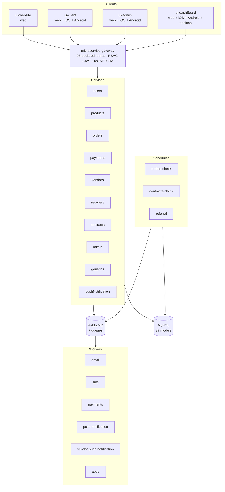

# iKomida — Platform Overview

> **This repository is the entry point to the iKomida platform.** It holds the
> Kubernetes, Cloud Build and database configuration that ties together
> **31 repositories**, and it is the best place to start reading if you want to
> understand how the system fits together.

iKomida was a food ordering and delivery platform for the Brazilian market,
built in 2022 as a startup. The company did not succeed commercially, but the
codebase is a complete, deployed, production-shaped system, and it is published
here in full.

**All of it was written before generative AI coding assistants were available.**
The commit history is public and dated.

---

## What the platform does

A multi-tenant marketplace where **vendors** publish products, **clients** place
and pay for orders, **resellers** earn referral revenue, and **staff/admins**
operate the business — delivered as web, Android, iOS and desktop applications
over a single API.

## Architecture at a glance



## The 31 repositories

### Infrastructure — 2

| Repository | Role |
|---|---|
| **[ikomida-k8s-config](https://github.com/kaitbellahs/ikomida-k8s-config)** | *(this repo)* GKE manifests for three environments, Cloud Build pipelines, managed TLS certificates, ingress, autoscaling, and the SQL schema with versioned migrations |
| [ikomida-rabbitmq](https://github.com/kaitbellahs/ikomida-rabbitmq) | The messaging broker's own image and cluster configuration |

### API gateway — 1

| Repository | Role |
|---|---|
| [ikomida-microservice-gateway](https://github.com/kaitbellahs/ikomida-microservice-gateway) | The single public entry point. Every route is a declarative object carrying its path, HTTP method, permitted roles, authentication requirement, target service and optional reCAPTCHA challenge — so authorization is data, not scattered middleware |

### Domain services — 10

Each is an Express + TypeScript service, containerized, deployed independently.

| Repository | Responsibility |
|---|---|
| [users](https://github.com/kaitbellahs/ikomida-microservice-users) | Accounts, profiles, addresses |
| [products](https://github.com/kaitbellahs/ikomida-microservice-products) | Catalog, categories, options, stock levels |
| [orders](https://github.com/kaitbellahs/ikomida-microservice-orders) | Order lifecycle, split by client and vendor perspective |
| [payments](https://github.com/kaitbellahs/ikomida-microservice-payments) | Charges, payment-provider webhooks, key distribution |
| [vendors](https://github.com/kaitbellahs/ikomida-microservice-vendors) | Vendor settings, storefront layout, staff, per-vendor apps |
| [resellers](https://github.com/kaitbellahs/ikomida-microservice-resellers) | Reseller accounts and bank details for payouts |
| [contracts](https://github.com/kaitbellahs/ikomida-microservice-contracts) | Subscription plans and signed contracts |
| [admin](https://github.com/kaitbellahs/ikomida-microservice-admin) | Back-office: statistics, plans, settings, terms |
| [generics](https://github.com/kaitbellahs/ikomida-microservice-generics) | Shared lookups and contact forms |
| [pushNotification](https://github.com/kaitbellahs/ikomida-microservice-pushNotification) | Notification registration and dispatch |

### Asynchronous workers — 6

Long-running RabbitMQ consumers, one queue each, with retry and explicit acknowledgement.

| Repository | Queue |
|---|---|
| [worker-email](https://github.com/kaitbellahs/ikomida-worker-email) | `EMAIL_QUEUE` — transactional email via Mailjet |
| [worker-sms](https://github.com/kaitbellahs/ikomida-worker-sms) | `SMS_QUEUE` — SMS via OtimaTel |
| [worker-payments](https://github.com/kaitbellahs/ikomida-worker-payments) | `PAYMENT_QUEUE` — payment processing |
| [worker-push-notification](https://github.com/kaitbellahs/ikomida-worker-push-notification) | `PUSH_NOTIFICATION_QUEUE` — client push |
| [worker-vendor-push-notification](https://github.com/kaitbellahs/ikomida-worker-vendor-push-notification) | `VENDOR_PUSH_NOTIFICATION_QUEUE` — vendor push |
| [worker-apps](https://github.com/kaitbellahs/ikomida-worker-apps) | `APPS_QUEUE` — per-vendor application builds |

### Scheduled jobs — 4

Run to completion on a schedule rather than staying resident.

| Repository | What it reconciles |
|---|---|
| [job-orders-check](https://github.com/kaitbellahs/ikomida-job-orders-check) | Sweeps orders left unpaid or open past a grace window and resolves them |
| [job-contracts-check](https://github.com/kaitbellahs/ikomida-job-contracts-check) | Subscription renewals and expiry |
| [job-referral](https://github.com/kaitbellahs/ikomida-job-referral) | Referral revenue attribution |
| [operations-job](https://github.com/kaitbellahs/ikomida-operations-job) | Schema migrations, key generation, and seeding of plans, settings and terms |

### Shared libraries — 4

Versioned npm packages consumed by every service, worker, job and front end. **This is what keeps the system consistent** — a type or a business rule exists once, not eleven times.

| Repository | Contents |
|---|---|
| [shared-types](https://github.com/kaitbellahs/ikomida-shared-types) | 58 domain classes, 28 enum type sets, serialization contracts — the vocabulary shared by back end and front end |
| [shared-backend](https://github.com/kaitbellahs/ikomida-shared-backend) | 37 Sequelize models, the RabbitMQ client, SQL layer, logging, decorators, and payment/messaging gateway integrations (Asaas, PagSeguro, Mailjet, OtimaTel) |
| [shared-logics](https://github.com/kaitbellahs/ikomida-shared-logics) | Business rules that must produce identical results on the server and in the client |
| [shared-frontend](https://github.com/kaitbellahs/ikomida-shared-frontend) | UI primitives, HTTP client, token handling, image resizing |

### Applications — 4

Svelte, compiled to web and wrapped with Capacitor for the app stores.

| Repository | Audience | Targets |
|---|---|---|
| [ui-client](https://github.com/kaitbellahs/ikomida-ui-client) | Customers ordering food | web · iOS · Android |
| [ui-dashBoard](https://github.com/kaitbellahs/ikomida-ui-dashBoard) | Vendors running their operation | web · iOS · Android · desktop (Electron) |
| [ui-admin](https://github.com/kaitbellahs/ikomida-ui-admin) | Platform back-office | web · iOS · Android |
| [ui-website](https://github.com/kaitbellahs/ikomida-ui-website) | Public site and sign-up | web |

---

## Engineering decisions worth noting

**Authorization is declarative.** The gateway's route table states, per endpoint,
which roles may call it and whether authentication is required. Adding an
endpoint means adding a row — you cannot forget to guard it, because the guard
*is* the declaration.

**Tokens are asymmetrically signed.** JWTs are signed with a private key held by
one service and verified with a public key everywhere else (`jose`,
`importSPKI` / `compactVerify`). A compromised downstream service can verify
tokens but cannot mint them.

**One vocabulary, many runtimes.** `shared-types` and `shared-logics` are
consumed unchanged by services, workers, jobs and the Svelte front ends, so a
price calculation or an order state machine cannot drift between the server and
the app displaying it.

**Slow work never blocks a request.** Email, SMS, push and app builds are
published to RabbitMQ and handled by dedicated workers with bounded retries and
explicit `ack`/`nack`.

**Reconciliation is assumed, not hoped for.** Scheduled jobs exist specifically
because distributed payment flows leave orders in ambiguous states, and
something has to sweep them.

**Three environments, one definition.** `k8s/`, `k8s-hmlg/` and `k8s-dev/` are
parallel trees for production, staging and development, applied by Cloud Build.

---

## What is in this repository

```
k8s/  k8s-hmlg/  k8s-dev/   Namespace, ingress, managed TLS, backend config,
                            and vertical pod autoscaling — one tree per
                            environment (production, staging, development)
cloudbuild.yaml             Cloud Build pipeline that applies the manifests
create-gke-ip.sh            Reserves the static ingress address
local-deploy.ps1            Local and remote deployment helpers
gcloud-local-deploy.ps1
corsOrigin.json             Cloud Storage CORS policy
db/migration/               Versioned schema migrations, up and down
db/dump*/                   Schema-only snapshots (structure, no data)
db/deleteAllTables.sql      Teardown helper
```

> **Note on `environment-secret.env`:** these files list the environment
> variables each deployment expects. Values are not distributed here — supply
> your own.

## Running it

The platform is no longer deployed, and these manifests reference
infrastructure that no longer exists. They are published as a record of how the
system was built and operated, not as a turnkey deployment. To stand it up you
would need your own GKE cluster, MySQL instance, RabbitMQ broker, and accounts
with the payment and messaging providers.

Build order matters: `shared-types` → `shared-logics` → `shared-backend` /
`shared-frontend` → everything else.

## License

Licensed under the [Apache License 2.0](LICENSE) — free for commercial use,
provided the copyright notice and [NOTICE](NOTICE) are retained.

Copyright 2022 Khalid Ait Bellahs.
